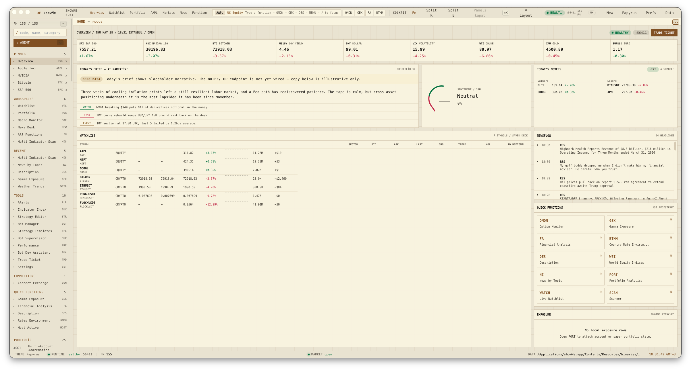
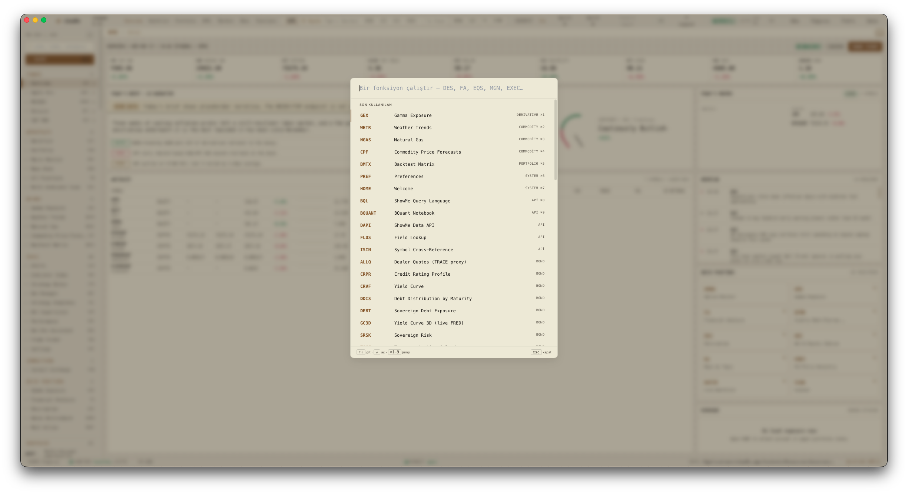
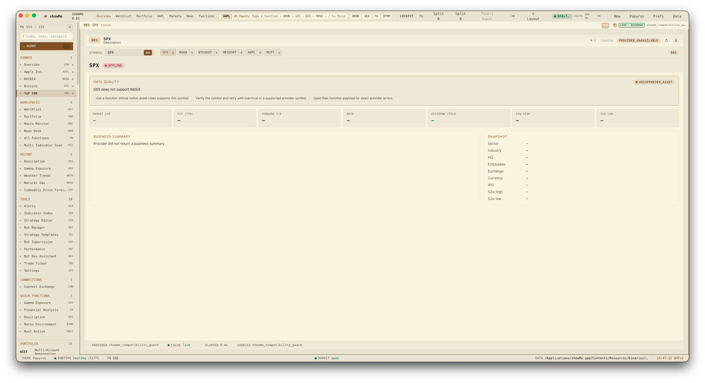
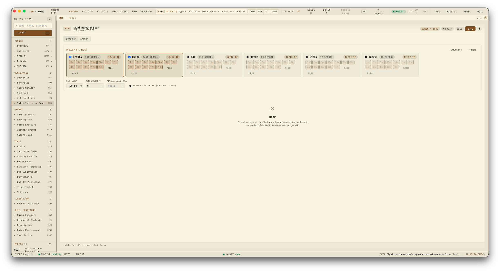

# showMe

[](LICENSE)
[](https://github.com/nazmiefearmutcu/showMe/stargazers)
[](https://tauri.app/)
[](https://python.org)
[](#)

Native macOS (ARM64) market cockpit. A thin Tauri shell, a React/Vite UI,
and a unified Python backend that ships the **141-function** market engine
(live snapshot of `/api/function-index`; baseline ≥138) as a regular
`showme.engine` subpackage.

## Preview

| Cockpit | Function library |
| --- | --- |
|  |  |

| Single-symbol research | Multi-Indicator Scan |
| --- | --- |
|  |  |

Native macOS .app (Tauri + signed updater). Boot from `/Applications/showMe.app` after a `npm run build:native`.


> **2026-05-25 rebuild:** Fallback-driven → contract-first. 143 manifest
> seeds registered, production-fakery scrubbed to 0 (strict-zero gate ON),
> sentiment + speech transcription + rates-event data wired, every panel
> header now surfaces a `📜 M` manifest dot + data-mode pill + sources +
> warnings.
> Full before/after + commit map: **[REBUILD_2026_05_25.md](REBUILD_2026_05_25.md)**.

> Last updated: 2026-05-25. Function/indicator/pane counts are the live
> values; if they drift, run `npm run audit:functions` and update.

## Layout

```
showMe/
├── tauri/                  Native macOS shell (Rust)
│   ├── src/                lifecycle, tray, menubar, dock, deep-link, biometric
│   ├── tauri.conf.json
│   ├── entitlements.plist
│   ├── icons/
│   ├── capabilities/
│   ├── binaries/           PyInstaller backend goes here
│   └── Cargo.toml
│
├── ui/                     React + Vite + Tailwind + zustand frontend
│   ├── src/
│   │   ├── App.tsx, main.tsx
│   │   ├── shell/          titlebar, sidebar, statusbar, symbolbar
│   │   ├── panes/          Splash, Welcome, Preferences, FunctionStub
│   │   ├── functions/      30 function components (PORT, WATCH, SCAN, …)
│   │   ├── lib/            sidecar HTTP client, store, router, state
│   │   ├── design-system/  Card, Toolbar, Pane, Tabs, Field, Crumb, …
│   │   ├── command-palette/
│   │   ├── i18n/           en, tr (12-lang ready)
│   │   └── styles/         tokens.css
│   ├── package.json
│   └── vite.config.ts
│
├── backend/                Unified Python sidecar + bundled engine
│   ├── pyproject.toml
│   ├── showme-backend.spec PyInstaller spec
│   ├── tests/              pytest suite (17 files)
│   ├── config/             default.yaml (engine thresholds, cooldowns)
│   └── showme/             single Python package
│       ├── server.py       FastAPI entry; /api/health, /function-index, /fn/*
│       ├── function_contracts.py
│       ├── scanner.py
│       ├── streams.py      exchange WS + polling fan-out
│       ├── quotes.py, state_api.py, chart_history.py, instant_line.py,
│       ├── migration.py, llm.py, crypto_aliases.py, veryfinder_bridge.py,
│       ├── agents/         orchestrator, planner, search, summarizer, viz
│       ├── brokers/        base, paper, alpaca, factory
│       ├── core/, services/, persistence/, ipc/, data_sources/
│       └── engine/         the bundled function engine (was engine/src/*)
│           ├── consensus/, indicators/ (23), functions/ (141 in 14 cats)
│           ├── data/, data_sources/, services/, trading/, control/
│           ├── monitoring/, persistence/, portfolio/, reference/
│           ├── core/, assets/, agents/, api/, utils/
│           └── main.py
│
├── packaging/              build / sign / notarize / dmg / deploy
├── scripts/                audit + dev tools (function audit, sentinels, …)
├── tests/                  cross-cutting Playwright e2e
├── docs/                   architecture, ui_standards, engine_independence,
│                           coder_log, round_notes/13.md → 33.md
├── package.json            root npm workspace (tauri, ui)
└── pyproject.toml          (lives at backend/, root has only npm/cargo)
```

The engine is now a regular Python subpackage (`from showme.engine.X import Y`)
— no more `sys.path` injection. Production builds bundle `backend/showme/engine/`
and `backend/config/` via the PyInstaller spec.

## Quickstart

```bash
# 1 — install front-end deps once
cd ui && npm install && cd ..

# 2 — install sidecar deps
cd backend && python3 -m pip install -e ".[dev]" && cd ..

# 3 — run dev (Tauri spawns sidecar + UI together)
npm run tauri:dev

# 4 — (optional but recommended) install pre-commit hooks
pip install pre-commit && pre-commit install
```

Without the Rust toolchain you can still inspect the UI in browser-mode:

```bash
# in two terminals:
cd backend && python3 -m showme.server --port 8765
cd ui && npm run dev    # http://localhost:5173
```

## Production build

```bash
bash packaging/build_sidecar.sh          # PyInstaller arm64 backend
npm run tauri:build                      # bundles .app + .dmg
APPLE_SIGNING_IDENTITY="Developer ID Application: ..." \
  bash packaging/sign.sh
APPLE_ID=... APPLE_TEAM_ID=... APPLE_APP_SPECIFIC_PASSWORD=... \
  bash packaging/notarize.sh
```

## Quality audits

```bash
npm run audit:functions         # asset-aware function sweep
npm run audit:sentinels         # sentinel / watchdog audit
npm run audit:legacy-functions  # legacy audit harness
npm run test:backend            # pytest in backend/
npm run lint && npm run lint:py # ESLint 9 + ruff
npm run test:e2e                # Playwright
```

The audit is asset-aware: it tests each function with a compatible crypto,
equity, FX, commodity, bond, or standalone option profile instead of forcing a
single symbol into every function.

## Runtime protocol

The Tauri shell discovers the Python runtime port from a single stdout line:

```
SIDECAR_PORT=<u16>
```

Lifecycle: 3× restart with exponential backoff (250 / 750 / 2250 ms), then
fatal `NSAlert`. SIGTERM → 5 s grace → SIGKILL on quit.

## Native conventions

- Custom titlebar (`Overlay`, hidden title) + macOS traffic lights at (14, 18).
- `app-region: drag` on titlebar; everything `.interactive` opts out.
- NSVisualEffect vibrancy via `windowEffects: ["sidebar", "underWindowBackground"]`.
- `~/Library/Application Support/showMe` for state; `~/Library/Logs/showMe`
  symlink for Console.app streaming.
- API keys in macOS Keychain (`app.showme.terminal/<name>`).
- All native chrome (NSMenuBar, NSStatusItem, NSDockTile, deep-link, hotkeys,
  LocalAuthentication) lives in `tauri/src/`; the WKWebView stays presentation-only.

## Refactor history

May 2026 — single-tree unification: merged `engine/` into `backend/showme/engine/`,
collapsed `src-tauri` → `tauri`, `src-py` → `backend`, `src-ui` → `ui`. Imports
rewritten from `src.X` to `showme.engine.X`. Pre-refactor snapshot at tag
`refactor-base-2026-05-09` and branch `backup-pre-restructure`.
