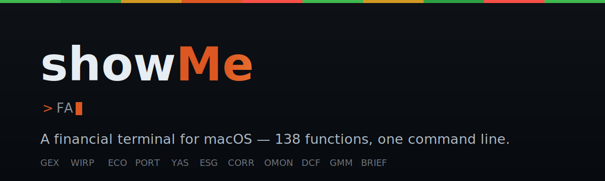
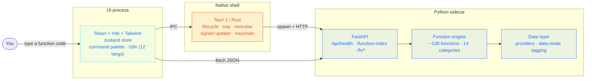

<p align="center">
  
</p>

<p align="center">
  <a href="LICENSE"></a>
  
  
  
  
  <a href="https://github.com/nazmiefearmutcu/showMe/releases/latest"></a>
</p>

<p align="center">
  <b>A financial terminal for macOS.</b> Type a short code, get an analyst function — about <b>138</b> of them,
  from company financials to options gamma to central-bank rate odds. Open source, runs entirely on your own
  machine, no subscription, no broker lock-in.
</p>

<p align="center">
  <a href="#what-is-showme">What is it</a> ·
  <a href="#preview">Preview</a> ·
  <a href="#how-the-terminal-works">How it works</a> ·
  <a href="#function-catalog">Functions</a> ·
  <a href="#honest-by-design">Honesty</a> ·
  <a href="#get-started">Get started</a> ·
  <a href="#architecture">Architecture</a>
</p>

## What is showMe?

showMe is a desktop **financial terminal** for macOS. Instead of hunting through menus, you drive it the way
professional desks do: type a short **function code** into a command line and the matching analyst tool opens —
`FA` for financial statements, `GEX` for options gamma exposure, `WIRP` for rate-hike odds, `ECO` for the
economic calendar. There are about **138 functions** spanning equities, options, bonds, FX, commodities, macro,
news, and portfolio analytics.

It's the kind of professional terminal workflow you'd otherwise pay for in a Bloomberg Terminal — rebuilt as
open source, running entirely on your own Mac, with no subscription and no broker lock-in.

Under the hood: a thin **Tauri 2** (Rust) shell with a signed updater, a **React + Vite** UI, and a unified
**Python (FastAPI)** sidecar that runs the function engine locally. Your data and keys never leave the machine.

## Preview

#### Cockpit


#### Command palette — every function, one keystroke away


#### A function in context


## How the terminal works

showMe has one core idea: a **command line for markets**. Press the palette shortcut, type a short code, hit
enter — the function opens as a pane. No two functions look the same, because each is a purpose-built tool, but
they all share the same launch gesture. If you know the code you want, you're one keystroke away; if you don't,
the palette filters by name as you type.

A taste of the breadth — twelve representative codes:

| Code | Function | What it shows |
| --- | --- | --- |
| `FA` | Financial Analysis | Income statement, balance sheet, cash flow |
| `DCF` | Discounted Cash Flow | Intrinsic-value model from projected free cash flow |
| `GEX` | Gamma Exposure | Dealer hedging structure across the option chain |
| `OMON` | Option Monitor | Single-name option chain with Greeks |
| `WIRP` | World Interest Rate Probability | Market-implied rate-hike / cut odds |
| `YAS` | Yield & Spread Analytics | Bond yield, spread, and curve positioning |
| `ECO` | Economic Calendar | Upcoming macro releases and prints |
| `CORR` | Correlation Matrix | Cross-asset correlation grid |
| `PORT` | Portfolio Analytics | Holdings, exposure, and performance |
| `ESG` | ESG Scores | Environmental / social / governance ratings |
| `GMM` | Global Macro Movers | What's moving across global macro |
| `BRIEF` | Daily Brief | A composed morning read across your surfaces |

## Function catalog

About **138 functions** across 14 categories. The exact set evolves; run `npm run audit:functions` for the live
list. A representative slice by category:

<details>
<summary><b>Show the function catalog</b></summary>

**Equities & fundamentals** — `FA` financials · `DCF` / `DDM` discounted cash flow · `DCFS` DCF sensitivity ·
`RV` relative valuation · `WACC` cost of capital · `BETA` CAPM beta · `EE` earnings & estimates ·
`EREV` earnings revisions · `ANR` analyst recommendations · `DVD` dividends & splits · `HDS` holders ·
`HFS` holder search · `FORM4` insider transactions · `DARK` / `DPF` dark-pool volume · `CACT` corporate actions ·
`FTS` SEC full-text search · `PIB` public information book · `DES` description · `EQS` equity screener.

**Options & derivatives** — `GEX` gamma exposure · `OMON` option monitor · `OVME` option valuation (Black-Scholes + Greeks).

**Bonds & rates** — `YAS` yield & spread · `CRVF` yield curve · `GC3D` 3-D yield curve · `WB` world bonds ·
`SRSK` sovereign risk · `TAUC` Treasury auction calendar · `CRPR` credit-rating profile.

**FX** — `FXH` FX hedge · `FXFC` FX forecasts.

**Commodities** — oil, natural gas, metals and weather-linked commodity functions (`BOIL`, `NGAS`, `GLCO`, `WETR`, …).

**Macro & economics** — `ECO` economic calendar · `ECST` economic statistics · `ECFC` economic forecasts ·
`WIRP` rate-probability · `GMM` global macro movers · `REGM` market regime · `BTMM` country rate environment ·
`COUN` country guide · `TRDH` trading hours.

**News & intelligence** — `TOP` top news · `CN` company news · `NI` news by topic · `BRIEF` daily brief ·
`TLDR` daily TL;DR · `NSE` news search · `SOSC` social sentiment · `TRAN` earnings-call transcripts ·
`TRQA` transcript Q&A · `TSAR` transcript sentiment · `EVTS` corporate events · `NALRT` critical news alerts ·
`READ` reading list · `AV` audio/video archive.

**Portfolio & risk** — `PORT` portfolio analytics · `PORT_OPT` optimizer · `CORR` correlation matrix ·
`GREEKS` portfolio Greeks · `PVAR` position VaR / MCR · `STRS` stress test · `PFA` performance attribution ·
`BLAK` Black-Litterman · `RPAR` risk parity · `REBA` rebalancer · `PSC` position sizing · `TLH` tax-loss harvesting ·
`LOTS` tax lots · `MGN` cross-account margin · `ACCT` multi-account aggregation · `PCAS` PCA factor stress ·
`MLSIG` ML signal · `BMTX` backtest matrix · `BTFW` walk-forward · `BTUNE` auto-tuner.

**Screen & maps** — `SECT` sector heatmap · `ICX` index constituents · `MAP` world market heatmap ·
`MICRO` market microstructure · `FRH` funding-rate heatmap.

**Trade execution** — `EXEC` execution monitor · `TCA` trade-cost analysis · `EMSX` execution management.

**Reference & data** — `ISIN` symbol cross-reference (OpenFIGI) · `FLDS` field lookup · `DAPI` data API ·
`BQL` query language · `BQUANT` notebook.

**Alt-data & alerts** — `ONCH` on-chain metrics · `WHAL` whale alerts · `POLY` Polymarket · `SAT` satellite imagery ·
`ALRT` alerts · `CDE` custom data fields.

</details>

## Honest by design

A finance tool is only as trustworthy as the data behind it, so showMe is explicit about provenance.

- **Data-mode pills.** Every function pane labels where its numbers came from — live exchange/vendor data,
  delayed reference data, or a *modeled* value (e.g. option Greeks computed from a pricing model).
- **Strict-zero gate.** When a live source is unavailable, a function shows a `PROVIDER_UNAVAILABLE` state
  instead of inventing plausible-looking fake data. No silent fakery.

### What showMe is — and isn't

| ✅ It is | ❌ It isn't |
| --- | --- |
| A local, open-source **financial terminal** | A live-money broker by default — execution is **paper trading** out of the box |
| **macOS (Apple Silicon)** native app | Cross-platform — there is no Windows/Linux/Intel build |
| **100% local** — your data and keys stay on the machine | A cloud service — there are no showMe servers |
| **MIT-licensed**, free, no subscription | Investment advice or a guarantee — provided **as-is**, no warranty |

## Architecture



The Tauri shell discovers the sidecar's port from a single stdout line (`SIDECAR_PORT=<u16>`), restarts it up to
3× with exponential backoff on failure, and tears it down with a SIGTERM → 5 s grace → SIGKILL on quit. The
WKWebView stays presentation-only; all native chrome (menubar, tray, dock, deep links, hotkeys, biometric unlock)
lives in Rust.

## Tech stack

| Layer | Stack |
| --- | --- |
| Native shell | Tauri 2 (Rust), code-signed `.app` + `.dmg`, signed updater |
| UI | React 18 · Vite 5 · Tailwind 4 · zustand 5 · TypeScript 5 · lightweight-charts 5 |
| Backend | Python 3.11+ · FastAPI · Uvicorn · pydantic 2 · DuckDB · Polars |
| Packaging | PyInstaller (arm64 onedir sidecar) |

## Data sources

Most functions pull **keyless, public** data; a few are opt-in and need a key.

| Provider | Used for |
| --- | --- |
| yfinance | Equities, ETFs, FX, commodities, bonds — OHLCV and quotes |
| Binance | Crypto spot and perpetuals |
| FRED | Macro time series |
| SEC EDGAR | Filings and full-text search |
| GDELT | Global news / events |
| OpenFIGI | Identifier cross-reference (ISIN / CUSIP / ticker) |
| Treasury Direct | US Treasury auctions |
| RSS feeds | Configurable news |

## AI features (opt-in)

These are off by default and each needs its own model or key:

| Feature | What it does | Needs |
| --- | --- | --- |
| FinBERT sentiment | Scores news headlines positive / neutral / negative | Bundled model (first call loads it) |
| Whisper transcription | Turns earnings-call audio into text | Local Whisper model |
| X / social sentiment | Sentiment on posts mentioning a ticker | Your X API key |
| LLM assistant | A conversational analyst over your data | OpenAI key **or** a local Ollama model |

## Get started

### Download

Grab the latest signed build from **[Releases](https://github.com/nazmiefearmutcu/showMe/releases/latest)**
(`showMe_0.1.1_aarch64.dmg`, macOS Apple Silicon).

### Run from source (dev)

```bash
# 1 — UI deps
cd ui && npm install && cd ..

# 2 — sidecar deps
cd backend && python3 -m pip install -e ".[dev]" && cd ..

# 3 — run dev (Tauri spawns the sidecar + UI together)
npm run tauri:dev
```

No Rust toolchain? Inspect the UI in the browser:

```bash
# terminal 1
cd backend && python3 -m showme.server --port 8765
# terminal 2
cd ui && npm run dev        # http://localhost:5173
```

### Build a native bundle

```bash
bash packaging/build_sidecar.sh   # PyInstaller arm64 sidecar
npm run tauri:build               # .app + .dmg
```

Signing and notarization (optional, needs Apple credentials) live in `packaging/sign.sh` and
`packaging/notarize.sh`.

## Project layout

<details>
<summary><b>Show the directory tree</b></summary>

```
showMe/
├── tauri/        Native macOS shell (Rust): lifecycle, tray, menubar, deep-link, biometric
├── ui/           React + Vite + Tailwind + zustand frontend
│   └── src/      shell · panes · functions · command-palette · i18n (12 langs) · design-system
├── backend/      Python FastAPI sidecar + function engine
│   └── showme/   server · function_contracts · providers · brokers · agents
│       └── engine/functions/   the ~138 functions, in 14 category folders
├── packaging/    build / sign / notarize / dmg
├── scripts/      audits & dev tools (npm run audit:functions, …)
├── tests/        cross-cutting Playwright e2e
└── docs/         architecture, screenshots, specs, plans
```

</details>

## Development & testing

```bash
npm run test:backend          # backend pytest suite
npm --workspace ui test       # UI vitest suite
npm run test:e2e:smoke:fast   # fast Playwright smoke path
npm run audit:functions       # live function inventory
npm run lint && npm run lint:py
```

Contributions welcome — see [CONTRIBUTING.md](CONTRIBUTING.md) and [SECURITY.md](SECURITY.md).

## License

[MIT](LICENSE) © 2026 Nazmi Efe Armutcu. Provided as-is, with no warranty. Not investment advice.
