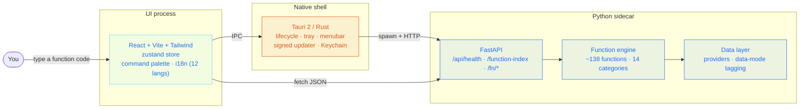

# showMe README Rewrite — Implementation Plan

> **For agentic workers:** REQUIRED SUB-SKILL: Use superpowers:subagent-driven-development (recommended) or superpowers:executing-plans to implement this plan task-by-task. Steps use checkbox (`- [ ]`) syntax for tracking.

**Goal:** Replace `README.md` with a from-scratch rewrite that introduces showMe as a *financial terminal* (function-code workstation), removes the MIS scanner entirely, uses verified numbers, and ships a custom SVG hero banner.

**Architecture:** Two deliverables only — `docs/assets/hero.svg` (new banner) and `README.md` (full rewrite). No code changes. Verification is done with `grep` gates (forbidden strings, required strings) and a GitHub-render check on a branch, not unit tests.

**Tech Stack:** Markdown + GitHub-flavored extensions (mermaid, `<details>`, inline HTML ``/`<p align>`), static SVG.

**Spec:** `docs/superpowers/specs/2026-06-08-readme-rewrite-design.md`

---

## Verified data (single source of truth — do not re-derive)

- **Functions:** ~138 distinct codes in `backend/showme/engine/functions/` across 14 category folders.
- **Asset classes:** 6 (equities, options, bonds, FX, commodities, crypto).
- **UI languages:** 12 (`ui/src/i18n/*.json`).
- **Versions:** Tauri 2 / app 0.1.1 · React 18.3.1 · Vite 5.4.10 · Tailwind 4.3.0 · zustand 5.0.1 · TypeScript 5.6.3 · lightweight-charts 5.2.0 · Python ≥3.11 · FastAPI ≥0.115 · pydantic ≥2.10.6 · DuckDB ≥1.1 · Polars ≥1.0 · yfinance ≥0.2.55 · ccxt ≥4.4 · torch ≥2.6 · transformers ≥4.48.
- **Data providers (`backend/showme/providers/`):** yfinance, Binance, FRED, GDELT, OpenFIGI, RSS news, SEC EDGAR, Treasury Direct.
- **Release:** latest = v0.1.1, asset `showMe_0.1.1_aarch64.dmg`. Download link: `https://github.com/nazmiefearmutcu/showMe/releases/latest`.
- **Screenshots used (3):** `docs/screenshots/01-cockpit.png`, `docs/screenshots/02-function-palette.png`, `docs/screenshots/03-symbol-equity-view.png`. **Not used:** `02-mis-scan.png`, `04-mis-scan.png`.
- **Forbidden in output:** `MIS`, `scan`/`scanner`, `consensus`, `ZAK`, `3,375`/`3 370`/`3370`, `12 timeframes`, `23 indicators`, `141-function`, "2026-05-25 rebuild", "Last updated", "Refactor history". Bloomberg appears **exactly once**.

---

## File structure

| File | Responsibility |
| --- | --- |
| `docs/assets/hero.svg` | New static hero banner — terminal aesthetic, brand orange `#dc5721`. |
| `README.md` | Full rewrite per the section order in the spec. |

---

## Task 1: Create the hero banner SVG

**Files:**
- Create: `docs/assets/hero.svg`

- [ ] **Step 1: Write the SVG file**

Write exactly this to `docs/assets/hero.svg`:

```svg
<svg xmlns="http://www.w3.org/2000/svg" viewBox="0 0 1200 360" role="img" aria-label="showMe — a financial terminal for macOS">
  <defs>
    <linearGradient id="bg" x1="0" y1="0" x2="0" y2="1">
      <stop offset="0" stop-color="#0e1116"/>
      <stop offset="1" stop-color="#070a0e"/>
    </linearGradient>
    <linearGradient id="accent" x1="0" y1="0" x2="1" y2="0">
      <stop offset="0" stop-color="#dc5721"/>
      <stop offset="1" stop-color="#f0883e"/>
    </linearGradient>
  </defs>
  <rect width="1200" height="360" fill="url(#bg)"/>
  <!-- top sector heat strip -->
  <g>
    <rect x="0"    y="0" width="120" height="6" fill="#3fb950"/>
    <rect x="120"  y="0" width="120" height="6" fill="#2ea043"/>
    <rect x="240"  y="0" width="120" height="6" fill="#d29922"/>
    <rect x="360"  y="0" width="120" height="6" fill="#dc5721"/>
    <rect x="480"  y="0" width="120" height="6" fill="#f85149"/>
    <rect x="600"  y="0" width="120" height="6" fill="#3fb950"/>
    <rect x="720"  y="0" width="120" height="6" fill="#d29922"/>
    <rect x="840"  y="0" width="120" height="6" fill="#2ea043"/>
    <rect x="960"  y="0" width="120" height="6" fill="#f85149"/>
    <rect x="1080" y="0" width="120" height="6" fill="#3fb950"/>
  </g>
  <!-- wordmark -->
  <text x="80" y="160" font-family="ui-monospace, 'SF Mono', Menlo, Consolas, monospace" font-size="92" font-weight="700" fill="#e6edf3">show<tspan fill="url(#accent)">Me</tspan></text>
  <!-- command-line prompt -->
  <g font-family="ui-monospace, 'SF Mono', Menlo, Consolas, monospace" font-size="26">
    <text x="84" y="224" fill="#dc5721">&gt;</text>
    <text x="112" y="224" fill="#8b949e">FA</text>
    <rect x="150" y="203" width="13" height="26" fill="#dc5721"/>
  </g>
  <!-- tagline -->
  <text x="80" y="286" font-family="ui-monospace, 'SF Mono', Menlo, Consolas, monospace" font-size="27" fill="#adbac7">A financial terminal for macOS — 138 functions, one command line.</text>
  <!-- function-code chips -->
  <g font-family="ui-monospace, 'SF Mono', Menlo, Consolas, monospace" font-size="18" fill="#6e7681">
    <text x="80"  y="330">GEX</text>
    <text x="140" y="330">WIRP</text>
    <text x="214" y="330">ECO</text>
    <text x="268" y="330">PORT</text>
    <text x="340" y="330">YAS</text>
    <text x="396" y="330">ESG</text>
    <text x="452" y="330">CORR</text>
    <text x="524" y="330">OMON</text>
    <text x="598" y="330">DCF</text>
    <text x="654" y="330">GMM</text>
    <text x="716" y="330">BRIEF</text>
  </g>
</svg>
```

- [ ] **Step 2: Verify the SVG is well-formed**

Run (Node's HTML/XML-safe check, no stdlib XML parser): `node -e "const s=require('fs').readFileSync('docs/assets/hero.svg','utf8'); if(!s.trim().startsWith('<svg')||!s.trim().endsWith('</svg>')) throw new Error('not a complete svg'); const o=(s.match(/<svg/g)||[]).length, c=(s.match(/<\/svg>/g)||[]).length; if(o!==c) throw new Error('tag mismatch'); console.log('OK svg well-formed')"`
Expected: `OK svg well-formed`

- [ ] **Step 3: Commit**

```bash
git add docs/assets/hero.svg
git commit -m "docs(readme): add terminal-style hero banner svg"
```

---

## Task 2: Write the new README.md

**Files:**
- Modify (full overwrite): `README.md`

- [ ] **Step 1: Overwrite `README.md` with the complete content below**

````markdown
<p align="center">
  
</p>

<p align="center">
  <a href="LICENSE"></a>
  
  
  
  
  <a href="https://github.com/nazmiefearmutcu/showMe/releases/latest"></a>
</p>

<p align="center">
  <b>A financial terminal for macOS.</b> Type a short code, get an analyst function — about <b>138</b> of them,
  from company financials to options gamma to central-bank rate odds. Open source, runs entirely on your own
  machine, no subscription, no broker lock-in.
</p>

<p align="center">
  <a href="#what-is-showme">What is it</a> ·
  <a href="#preview">Preview</a> ·
  <a href="#how-the-terminal-works">How it works</a> ·
  <a href="#function-catalog">Functions</a> ·
  <a href="#honest-by-design">Honesty</a> ·
  <a href="#get-started">Get started</a> ·
  <a href="#architecture">Architecture</a>
</p>

## What is showMe?

showMe is a desktop **financial terminal** for macOS. Instead of hunting through menus, you drive it the way
professional desks do: type a short **function code** into a command line and the matching analyst tool opens —
`FA` for financial statements, `GEX` for options gamma exposure, `WIRP` for rate-hike odds, `ECO` for the
economic calendar. There are about **138 functions** spanning equities, options, bonds, FX, commodities, macro,
news, and portfolio analytics.

It's the kind of professional terminal workflow you'd otherwise pay for in a Bloomberg Terminal — rebuilt as
open source, running entirely on your own Mac, with no subscription and no broker lock-in.

Under the hood: a thin **Tauri 2** (Rust) shell with a signed updater, a **React + Vite** UI, and a unified
**Python (FastAPI)** sidecar that runs the function engine locally. Your data and keys never leave the machine.

## Preview

#### Cockpit


#### Command palette — every function, one keystroke away


#### A function in context


## How the terminal works

showMe has one core idea: a **command line for markets**. Press the palette shortcut, type a short code, hit
enter — the function opens as a pane. No two functions look the same, because each is a purpose-built tool, but
they all share the same launch gesture. If you know the code you want, you're one keystroke away; if you don't,
the palette filters by name as you type.

A taste of the breadth — twelve representative codes:

| Code | Function | What it shows |
| --- | --- | --- |
| `FA` | Financial Analysis | Income statement, balance sheet, cash flow |
| `DCF` | Discounted Cash Flow | Intrinsic-value model from projected free cash flow |
| `GEX` | Gamma Exposure | Dealer hedging structure across the option chain |
| `OMON` | Option Monitor | Single-name option chain with Greeks |
| `WIRP` | World Interest Rate Probability | Market-implied rate-hike / cut odds |
| `YAS` | Yield & Spread Analytics | Bond yield, spread, and curve positioning |
| `ECO` | Economic Calendar | Upcoming macro releases and prints |
| `CORR` | Correlation Matrix | Cross-asset correlation grid |
| `PORT` | Portfolio Analytics | Holdings, exposure, and performance |
| `ESG` | ESG Scores | Environmental / social / governance ratings |
| `GMM` | Global Macro Movers | What's moving across global macro |
| `BRIEF` | Daily Brief | A composed morning read across your surfaces |

## Function catalog

About **138 functions** across 14 categories. The exact set evolves; run `npm run audit:functions` for the live
list. A representative slice by category:

<details>
<summary><b>Show the function catalog</b></summary>

**Equities & fundamentals** — `FA` financials · `DCF` / `DDM` discounted cash flow · `DCFS` DCF sensitivity ·
`RV` relative valuation · `WACC` cost of capital · `BETA` CAPM beta · `EE` earnings & estimates ·
`EREV` earnings revisions · `ANR` analyst recommendations · `DVD` dividends & splits · `HDS` holders ·
`HFS` holder search · `FORM4` insider transactions · `DARK` / `DPF` dark-pool volume · `CACT` corporate actions ·
`FTS` SEC full-text search · `PIB` public information book · `DES` description · `EQS` equity screener.

**Options & derivatives** — `GEX` gamma exposure · `OMON` option monitor · `OVME` option valuation (Black-Scholes + Greeks).

**Bonds & rates** — `YAS` yield & spread · `CRVF` yield curve · `GC3D` 3-D yield curve · `WB` world bonds ·
`SRSK` sovereign risk · `TAUC` Treasury auction calendar · `CRPR` credit-rating profile.

**FX** — `FXH` FX hedge · `FXFC` FX forecasts.

**Commodities** — oil, natural gas, metals and weather-linked commodity functions (`BOIL`, `NGAS`, `GLCO`, `WETR`, …).

**Macro & economics** — `ECO` economic calendar · `ECST` economic statistics · `ECFC` economic forecasts ·
`WIRP` rate-probability · `GMM` global macro movers · `REGM` market regime · `BTMM` country rate environment ·
`COUN` country guide · `TRDH` trading hours.

**News & intelligence** — `TOP` top news · `CN` company news · `NI` news by topic · `BRIEF` daily brief ·
`TLDR` daily TL;DR · `NSE` news search · `SOSC` social sentiment · `TRAN` earnings-call transcripts ·
`TRQA` transcript Q&A · `TSAR` transcript sentiment · `EVTS` corporate events · `NALRT` critical news alerts ·
`READ` reading list · `AV` audio/video archive.

**Portfolio & risk** — `PORT` portfolio analytics · `PORT_OPT` optimizer · `CORR` correlation matrix ·
`GREEKS` portfolio Greeks · `PVAR` position VaR / MCR · `STRS` stress test · `PFA` performance attribution ·
`BLAK` Black-Litterman · `RPAR` risk parity · `REBA` rebalancer · `PSC` position sizing · `TLH` tax-loss harvesting ·
`LOTS` tax lots · `MGN` cross-account margin · `ACCT` multi-account aggregation · `PCAS` PCA factor stress ·
`MLSIG` ML signal · `BMTX` backtest matrix · `BTFW` walk-forward · `BTUNE` auto-tuner.

**Screen & maps** — `SECT` sector heatmap · `ICX` index constituents · `MAP` world market heatmap ·
`MICRO` market microstructure · `FRH` funding-rate heatmap.

**Trade execution** — `EXEC` execution monitor · `TCA` trade-cost analysis · `EMSX` execution management.

**Reference & data** — `ISIN` symbol cross-reference (OpenFIGI) · `FLDS` field lookup · `DAPI` data API ·
`BQL` query language · `BQUANT` notebook.

**Alt-data & alerts** — `ONCH` on-chain metrics · `WHAL` whale alerts · `POLY` Polymarket · `SAT` satellite imagery ·
`ALRT` alerts · `CDE` custom data fields.

</details>

## Honest by design

A finance tool is only as trustworthy as the data behind it, so showMe is explicit about provenance.

- **Data-mode pills.** Every function pane labels where its numbers came from — live exchange/vendor data,
  delayed reference data, or a *modeled* value (e.g. option Greeks computed from a pricing model).
- **Strict-zero gate.** When a live source is unavailable, a function shows a `PROVIDER_UNAVAILABLE` state
  instead of inventing plausible-looking fake data. No silent fakery.

### What showMe is — and isn't

| ✅ It is | ❌ It isn't |
| --- | --- |
| A local, open-source **financial terminal** | A live-money broker by default — execution is **paper trading** out of the box |
| **macOS (Apple Silicon)** native app | Cross-platform — there is no Windows/Linux/Intel build |
| **100% local** — your data and keys stay on the machine | A cloud service — there are no showMe servers |
| **MIT-licensed**, free, no subscription | Investment advice or a guarantee — provided **as-is**, no warranty |

## Architecture



The Tauri shell discovers the sidecar's port from a single stdout line (`SIDECAR_PORT=<u16>`), restarts it up to
3× with exponential backoff on failure, and tears it down with a SIGTERM → 5 s grace → SIGKILL on quit. The
WKWebView stays presentation-only; all native chrome (menubar, tray, dock, deep links, hotkeys, biometric unlock)
lives in Rust.

## Tech stack

| Layer | Stack |
| --- | --- |
| Native shell | Tauri 2 (Rust), code-signed `.app` + `.dmg`, signed updater |
| UI | React 18 · Vite 5 · Tailwind 4 · zustand 5 · TypeScript 5 · lightweight-charts 5 |
| Backend | Python 3.11+ · FastAPI · Uvicorn · pydantic 2 · DuckDB · Polars |
| Packaging | PyInstaller (arm64 onedir sidecar) |

## Data sources

Most functions pull **keyless, public** data; a few are opt-in and need a key.

| Provider | Used for |
| --- | --- |
| yfinance | Equities, ETFs, FX, commodities, bonds — OHLCV and quotes |
| Binance | Crypto spot and perpetuals |
| FRED | Macro time series |
| SEC EDGAR | Filings and full-text search |
| GDELT | Global news / events |
| OpenFIGI | Identifier cross-reference (ISIN / CUSIP / ticker) |
| Treasury Direct | US Treasury auctions |
| RSS feeds | Configurable news |

## AI features (opt-in)

These are off by default and each needs its own model or key:

| Feature | What it does | Needs |
| --- | --- | --- |
| FinBERT sentiment | Scores news headlines positive / neutral / negative | Bundled model (first call loads it) |
| Whisper transcription | Turns earnings-call audio into text | Local Whisper model |
| X / social sentiment | Sentiment on posts mentioning a ticker | Your X API key |
| LLM assistant | A conversational analyst over your data | OpenAI key **or** a local Ollama model |

## Get started

### Download

Grab the latest signed build from **[Releases](https://github.com/nazmiefearmutcu/showMe/releases/latest)**
(`showMe_0.1.1_aarch64.dmg`, macOS Apple Silicon).

### Run from source (dev)

```bash
# 1 — UI deps
cd ui && npm install && cd ..

# 2 — sidecar deps
cd backend && python3 -m pip install -e ".[dev]" && cd ..

# 3 — run dev (Tauri spawns the sidecar + UI together)
npm run tauri:dev
```

No Rust toolchain? Inspect the UI in the browser:

```bash
# terminal 1
cd backend && python3 -m showme.server --port 8765
# terminal 2
cd ui && npm run dev        # http://localhost:5173
```

### Build a native bundle

```bash
bash packaging/build_sidecar.sh   # PyInstaller arm64 sidecar
npm run tauri:build               # .app + .dmg
```

Signing and notarization (optional, needs Apple credentials) live in `packaging/sign.sh` and
`packaging/notarize.sh`.

## Project layout

<details>
<summary><b>Show the directory tree</b></summary>

```
showMe/
├── tauri/        Native macOS shell (Rust): lifecycle, tray, menubar, deep-link, biometric
├── ui/           React + Vite + Tailwind + zustand frontend
│   └── src/      shell · panes · functions · command-palette · i18n (12 langs) · design-system
├── backend/      Python FastAPI sidecar + function engine
│   └── showme/   server · function_contracts · providers · brokers · agents
│       └── engine/functions/   the ~138 functions, in 14 category folders
├── packaging/    build / sign / notarize / dmg
├── scripts/      audits & dev tools (npm run audit:functions, …)
├── tests/        cross-cutting Playwright e2e
└── docs/         architecture, screenshots, specs, plans
```

</details>

## Development & testing

```bash
npm run test:backend          # backend pytest suite
npm --workspace ui test       # UI vitest suite
npm run test:e2e:smoke:fast   # fast Playwright smoke path
npm run audit:functions       # live function inventory
npm run lint && npm run lint:py
```

Contributions welcome — see [CONTRIBUTING.md](CONTRIBUTING.md) and [SECURITY.md](SECURITY.md).

## License

[MIT](LICENSE) © 2026 Nazmi Efe Armutcu. Provided as-is, with no warranty. Not investment advice.
````

- [ ] **Step 2: Confirm the file written and inspect length**

Run: `wc -l README.md && head -5 README.md`
Expected: file exists, first line is the `<p align="center">` banner block.

---

## Task 3: Verification gates

**Files:** none (read-only checks)

- [ ] **Step 1: Forbidden-string gate (must output nothing)**

Run:
```bash
grep -nE '\bMIS\b|scanner|scann|consensus|ZAK|3,375|3 370|3370|12 timeframes|23 indicators|141-function|2026-05-25 rebuild|Last updated|Refactor history' README.md
```
Expected: **no output** (exit 1). If anything prints, remove it.

- [ ] **Step 2: Bloomberg-appears-exactly-once gate**

Run: `grep -oc 'Bloomberg' README.md` then `grep -n 'Bloomberg' README.md`
Expected: count is **1**, and the single line is the positioning sentence in "What is showMe?".

- [ ] **Step 3: Required-content gate (each must print a line)**

Run:
```bash
for s in 'financial terminal' 'docs/assets/hero.svg' '01-cockpit.png' '02-function-palette.png' '03-symbol-equity-view.png' 'releases/latest' 'paper trading' 'data-mode' 'mermaid'; do
  grep -q "$s" README.md && echo "OK: $s" || echo "MISSING: $s"
done
```
Expected: nine `OK:` lines, zero `MISSING:`.

- [ ] **Step 4: Scan screenshots are NOT referenced**

Run: `grep -nE 'mis-scan' README.md`
Expected: **no output**.

- [ ] **Step 5: Markdown / mermaid sanity (Node, no install)**

Run: `node -e "const t=require('fs').readFileSync('README.md','utf8'); const open=(t.match(/<details>/g)||[]).length, close=(t.match(/<\/details>/g)||[]).length; if(open!==close) throw new Error('details mismatch '+open+'/'+close); if(!t.includes('\`\`\`mermaid')) throw new Error('no mermaid'); console.log('OK details='+open+' mermaid=yes')"`
Expected: `OK details=2 mermaid=yes`.

---

## Task 4: Visual render check on a branch (GitHub truth)

**Files:** none

- [ ] **Step 1: Commit the README on the current branch**

```bash
git add README.md
git commit -m "docs(readme): rewrite as a financial-terminal intro; drop scanner; verified numbers"
```

- [ ] **Step 2: Push the branch and open the rendered README**

```bash
git push -u origin HEAD
```
Then open `https://github.com/nazmiefearmutcu/showMe/blob/<branch>/README.md` and confirm: banner renders, badges load, 3 screenshots show, mermaid diagram draws, both `<details>` expand, the marquee + catalog tables align. Fix any rendering issue and amend.

- [ ] **Step 3 (after user OK): merge to main**

Open a PR or fast-forward `main`, per the user's preference.

---

## Self-review (completed by author)

- **Spec coverage:** hero+banner (T1), terminal framing & "What is" (T2 §What is), preview 3 shots (T2 §Preview), how-it-works + marquee (T2), full catalog in `<details>` (T2), honesty + is/isn't (T2), architecture mermaid (T2), tech stack / data sources / AI (T2), get-started incl. download (T2), layout + dev/testing (T2), MIS fully removed & verified (T3 §1/§4), Bloomberg-once (T3 §2), numbers soft-stated (T2 + verified data block). ✔ all spec sections mapped.
- **Placeholder scan:** none — full SVG and full README body are embedded verbatim. ✔
- **Consistency:** function codes/titles in the catalog match the verified extraction; screenshot filenames match the three approved files; the single Bloomberg sentence lives only in "What is showMe?". ✔
